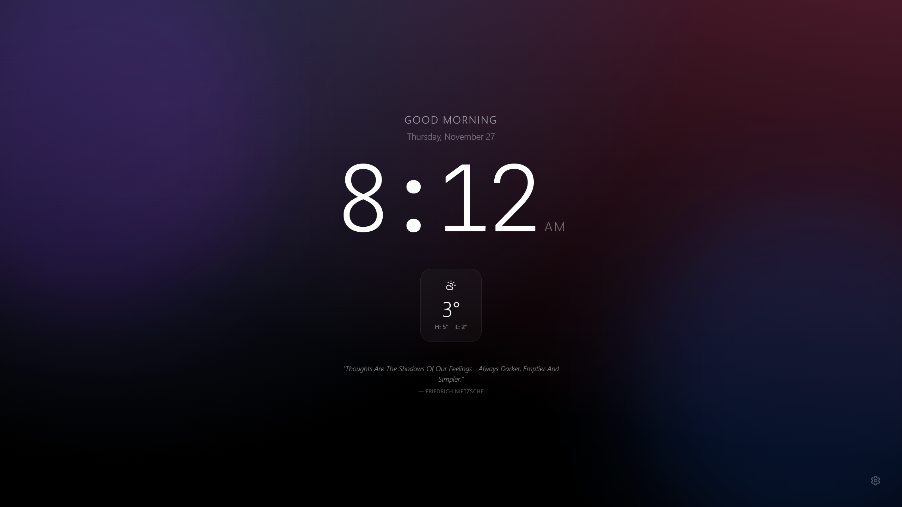
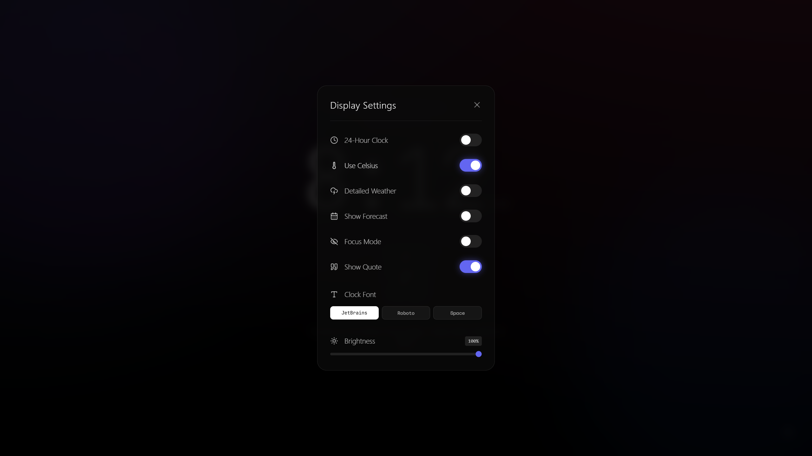

# Simple Clock

> A beautiful, customizable clock display with weather, quotes, and pomodoro timer. The project was initially created for my spare laptop.

**Live Demo**: [clock.zyhe.me](https://clock.zyhe.me)



## Running Locally

1. **Clone the repository**:
   ```bash
   git clone https://github.com/Ate329/simple-clock.git
   cd simple-clock
   ```

2. **Install dependencies**:
   ```bash
   npm install
   ```

3. **Start development server**:
   ```bash
   npm run dev
   ```

4. **Open in Browser**:
   Visit [http://localhost:5173](http://localhost:5173)

## Features

### Dynamic Clock Display
- Large, readable time with customizable fonts (JetBrains Mono, Roboto Mono, Space Mono)
- 12-hour or 24-hour format
- Automatic greeting based on time of day
- Full date display

### Real-Time Weather
- Auto-detects your location
- Current temperature with high/low forecasts
- 3-day weather forecast
- Detailed view with humidity and wind speed
- Celsius or Fahrenheit toggle
- Weather code-based icons

### Pomodoro Timer
- Fully functional pomodoro timer with focus sessions and breaks
- Customizable focus duration (1-60 min)
- Customizable short break (1-30 min)  
- Customizable long break (5-60 min)
- Configurable sessions before long break (2-10 sessions)
- Auto-start options for breaks and focus sessions
- Session progress tracking with dot indicators
- **Inner progress circle** - tracks entire cycle progress including all breaks
- Completion celebration screen when all sessions finished
- Audio feedback with Web Audio API
- Skip, pause, and reset controls

### Inspirational Quotes
- Random quotes with smart caching
- Refreshes every 4 hours
- Elegant typography display

### Beautiful Design & Themes
- **Multiple themes**: Aurora, Cyberpunk, Sunset, Ocean, Midnight
- Animated gradient backgrounds
- Glassmorphism UI with backdrop blur
- Smooth transitions and animations
- Dark mode optimized
- Ambient glow effects

### Customization
- **Focus Mode**: Minimalist view with just date and time
- **Brightness Control**: 10-100% adjustable overlay
- **Toggle Elements**: Show/hide weather, forecast, quotes, and pomodoro timer
- **Theme Selector**: Choose from 5 beautiful color schemes



## Usage

Click the **gear icon** in the bottom-right corner to open settings and customize your display.

Use the **navigation tabs** at the top to switch between Clock and Pomodoro views.

Press **F11** for fullscreen mode.

## Tech Stack

- **Framework**: React 19 with Vite
- **Styling**: Tailwind CSS 3.4
- **Icons**: Lucide React
- **Build Tool**: Vite 7
- **Linting**: ESLint 9

## API Information

### Weather Data
- **Provider**: [Open-Meteo](https://open-meteo.com/)
- **Cost**: Free (no API key required)
- **Privacy**: No personal data collection
- **Rate Limits**: Generous free tier

### Quotes
- **Provider**: [DummyJSON](https://dummyjson.com/)
- **Cost**: Free
- **Caching**: Local storage (refreshes every 4 hours)

## Project Structure

```
src/
├── components/
│   ├── Clock.jsx           # Main clock display
│   ├── DateDisplay.jsx     # Date component
│   ├── ForecastWidget.jsx  # 3-day weather forecast
│   ├── Greeting.jsx        # Time-based greeting
│   ├── HomePage.jsx        # Main clock page layout
│   ├── Navbar.jsx          # Navigation between views
│   ├── PomodoroPage.jsx    # Pomodoro page container
│   ├── PomodoroWidget.jsx  # Pomodoro timer with progress tracking
│   ├── QuoteWidget.jsx     # Inspirational quotes
│   ├── SettingsModal.jsx   # Settings panel
│   ├── WeatherIcon.jsx     # Weather condition icons
│   └── WeatherWidget.jsx   # Current weather display
├── App.jsx                 # Main app component with theme management
├── main.jsx               # React entry point
└── index.css              # Global styles and animations
```

## Credits

- Weather data by [Open-Meteo](https://open-meteo.com/)
- Quotes from [DummyJSON](https://dummyjson.com/)
- Icons by [Lucide](https://lucide.dev/)
- Fonts from [Google Fonts](https://fonts.google.com/)

## License

MIT License - feel free to use and modify!

---

**Star this repo if you like it :)**
